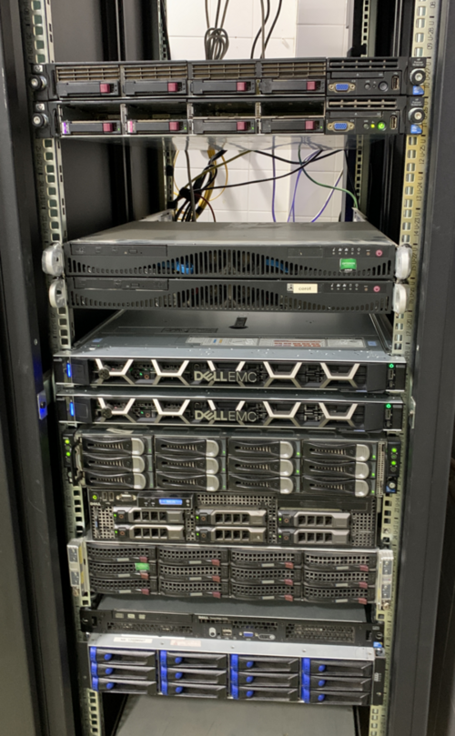
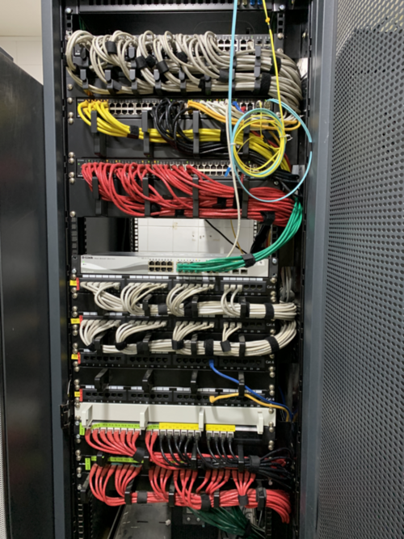

<!-- _class: portada -->
<!-- _paginate: false -->


# Virtualización con **Proxmox VE**

## Sesión 1 · Introducción a la virtualización con Proxmox VE

<p>José Domingo Muñoz &nbsp;·&nbsp; IES Gonzalo Nazareno &nbsp;·&nbsp; 2026</p>

---

<!-- _class: capitulo -->
<!-- _paginate: false -->


<p class="numero">01</p>

# ¿Qué es la virtualización?

## Conceptos clave y soluciones de Proxmox VE

---

## Virtualización: la idea fundamental

> La virtualización usa software para imitar las características del hardware
> y crear sistemas informáticos virtuales sobre una misma máquina física.


### Conceptos clave

- **Hipervisor**: software de virtualización que gestiona los recursos físicos y los reparte entre los sistemas invitados
- **Sistema anfitrión** (*host*): máquina física que ejecuta el hipervisor
- **Sistema invitado** (*guest*): sistema operativo que corre dentro del hipervisor


---

## Tipos de virtualización — Máquinas Virtuales

El hipervisor emula completamente el hardware físico. Los SO invitados se ejecutan **sin modificaciones**, usando extensiones del procesador (`Intel VT-x` / `AMD-V`) para acceso directo al hardware cuando es posible.

<div class="cols-2" style="margin-top:0.8rem">

<div class="card card-blue">

### Hipervisor tipo 1 *(bare-metal)*

- Se ejecuta **directamente sobre el hardware físico**, sin SO subyacente
- Necesarias las extensiones de virtualización en la CPU
- Rendimiento cercano al de una máquina física real

**Ejemplos:** VMware ESXi, Microsoft Hyper-V, Xen, **KVM**

</div>

<div class="card card-green">

### Hipervisor tipo 2 *(hosteado)*

- Se ejecuta **sobre un SO anfitrión** que gestiona el acceso al hardware
- Introduce una capa adicional → **menor rendimiento** que el tipo 1
- Ideal para uso en escritorio, pruebas o desarrollo local

**Ejemplos:** VMware Workstation, VirtualBox, Parallels Desktop, VMware Player

</div>

</div>

---

## KVM — Kernel-based Virtual Machine

**KVM** es un hipervisor de tipo 1 integrado directamente en el kernel de Linux desde la versión 2.6.20 (2007).

### Cómo funciona

- Convierte el kernel Linux en un hipervisor tipo 1
- Requiere extensiones de virtualización del procesador: `Intel VT-x` o `AMD-V`
- Cada máquina virtual es un **proceso normal** de Linux con acceso directo al hardware
- Se apoya en **QEMU** para emular los dispositivos de la VM (disco, red, USB…)
- Con **dispositivos paravirtualizados** (`virtio`), la VM accede directamente al hardware físico sin pasar por la emulación completa → **mayor rendimiento** (disco, red,...)

---

## Tipos de virtualización — Contenedores

La **virtualización ligera** no emula hardware: aísla procesos dentro del mismo SO. Cada contenedor comparte el kernel del host pero tiene su propio sistema de archivos, red y recursos.

<div class="cols-2" style="margin-top:0.8rem">

<div class="card card-purple">

### Contenedores de sistema

- Ejecutan una instancia aislada de un **SO completo**
- Espacio de usuario, red y almacenamiento independientes
- MV ligera, sin duplicar el kernel
- Arranque en segundos, necesita poca RAM

**Ejemplo:** LXC *(Linux Containers)*

</div>

<div class="card card-blue">

### Contenedores de aplicación

- Diseñados para ejecutar **un servicio o aplicación** de forma aislada
- Más ligeros que los de sistema: no virtualizan el SO completo
- Ideales para microservicios y despliegues en la nube

**Ejemplos:** Docker, Podman, Kubernetes (orquestador de contenedores)

</div>

</div>

---
<!-- _paginate: false -->
<!-- _class: destacado -->

<div style="display:flex; flex-direction:column; justify-content:center; align-items:center; height:100%; text-align:center;">

<p style="font-size:0.9rem; font-weight:700; text-transform:uppercase; letter-spacing:0.15em; color:var(--teal-500); margin-bottom:1.5rem;">Pregunta</p>

# ¿Qué sistema de virtualización<br>usas normalmente con los alumnos?

# ¿Has usado alguna vez LXC?  

<p style="font-size:0.85rem; color:var(--slate-400); margin-top:2rem;">💬 Comparte tu experiencia</p>

</div>

---

## ¿Qué es Proxmox VE?

**Proxmox Virtual Environment** es una plataforma de virtualización de código abierto basada en Debian que integra en una sola interfaz web:

<div class="cols-2" style="margin-top:0.2rem">

<div>

### Lo que incluye

- Hipervisor **KVM** para máquinas virtuales completas
- **LXC** para contenedores Linux ligeros
- **Almacenamiento** (local, Ceph, NFS, iSCSI…)
- **Redes** (bridges, VLANs, SDN)
- **Clúster** y alta disponibilidad
- **Backups** integrados con Proxmox Backup Server

</div>

<div>

### Características destacadas

<div class="alerta alerta-ok"><span>✅</span><div>Interfaz web completa — sin cliente adicional</div></div>
<div class="alerta alerta-ok" style="margin-top:0.1rem"><span>✅</span><div>Código abierto — licencia AGPL</div></div>
<div class="alerta alerta-ok" style="margin-top:0.1rem"><span>✅</span><div>API REST completa para automatización</div></div>
<div class="alerta alerta-ok" style="margin-top:0.1rem"><span>✅</span><div>Comunidad activa y excelente documentación</div></div>
<div class="alerta alerta-warning" style="margin-top:0.1rem"><span>⚠️</span><div>Soporte empresarial de pago opcional</div></div>

</div>

</div>

---

## Las dos soluciones de Proxmox VE

<div class="cols-2" style="margin-top:1rem">

<div>

### Máquinas Virtuales (KVM)

```
┌─────────────────────────────┐
│   VM1 (Debian)  VM2 (Win)   │
│  ┌───────────┐ ┌──────────┐ │
│  │ Kernel    │ │ Kernel   │ │
│  │ propio    │ │ propio   │ │
│  └─────┬─────┘ └────┬─────┘ │
│        └──────┬─────┘       │
│          KVM/QEMU           │
│      (Proxmox VE host)      │
└─────────────────────────────┘
```

- Hardware **completamente emulado** (**QEMU**)
- Dispositivos paravirtualizados (**virtio**)
- Cualquier SO: Linux, Windows, BSD...

</div>

<div>

### Contenedores (LXC)

```
┌─────────────────────────────┐
│  CT101 (Ubuntu) CT102 (Deb) │
│  ┌───────────┐ ┌──────────┐ │
│  │ /bin /etc │ │ /bin/etc │ │
│  │ procesos  │ │ procesos │ │
│  └─────┬─────┘ └────┬─────┘ │
│        └──────┬─────┘       │
│       Kernel compartido     │
│      (Proxmox VE host)      │
└─────────────────────────────┘
```

- Arrancan en **segundos**
- 5–10× menos RAM que una VM
- Solo distribuciones **Linux**

</div>

</div>

---

<!-- _class: capitulo -->
<!-- _paginate: false -->

<p class="numero">02</p>

# Proxmox VE vs otras soluciones

## Diferencias con OpenStack y otros sistemas

---

## Comparativa general

| Característica | Proxmox VE | OpenStack | VMware vSphere | oVirt |
|:---------------|:--------------:|:---------:|:--------------:|:-----:|
| Código abierto | ✅ | ✅ | ❌ | ✅ |
| Interfaz web integrada | ✅ | ⚠️ compleja | ✅ | ✅ |
| Curva de aprendizaje | Baja | Muy alta | Media | Media |
| KVM + LXC | ✅ | Solo KVM | ❌ | Solo KVM |
| Clúster y HA | ✅ | ✅ | ✅ | ✅ |
| Apto para educación | ✅✅ | ✅ | ⚠️ coste | ⚠️ |
| Instalación rápida | ✅ | ⚠️ | ❌ | ❌ |

---

## Proxmox VE vs OpenStack

<div class="cols-2" style="margin-top:0.8rem">

<div>

### OpenStack

- Plataforma de **IaaS** (*Infrastructure as a Service*)
- **Cloud Computing** sobre hardware propio
- El usuario consume recursos como en AWS o Azure, pero en privado
- Abstrae completamente el hipervisor subyacente
- Arquitectura distribuida de servicios: Nova, Neutron, Cinder, Glance…
- Ideal para enseñar **cloud privado** y los módulos de cloud de ASIR

</div>

<div>

### Proxmox VE

- Plataforma de **virtualización tradicional**
- Gestión directa de hipervisor: el administrador controla cada VM
- No abstrae el hardware: se trabaja con nodos, almacenamiento y redes reales
- Arquitectura simple: un nodo ya es completamente funcional
- Ideal para enseñar **administración de sistemas** y virtualización

</div>

</div>

<div class="alerta alerta-info" style="margin-top:0.8rem">
<span>ℹ️</span><div>Aunque ambas permiten gestionar máquinas virtuales, parten de concepciones distintas: OpenStack modela una <strong>nube</strong>; Proxmox VE es un <strong>hipervisor gestionado</strong>. En un centro con ASIR, las dos tienen cabida.</div>
</div>

---

## ¿Por qué Proxmox VE para un centro educativo?

<div class="cols-3" style="margin-top:1.2rem">

<div class="card card-blue">

### Para el alumno

- Entorno **propio y aislado**
- Acceso desde el **aula y desde casa**
- Aprende con tecnología usada en la **industria**
- Puede **romper y recrear** sin consecuencias

</div>

<div class="card card-green">

### Para el profesor

- Despliegue de entornos en **minutos**
- **Plantillas** reutilizables por módulo
- Sin **licencias** de pago
- **Panel web** accesible desde cualquier navegador

</div>

<div class="card card-purple">

### Para el centro

- Hardware propio → **soberanía tecnológica**
- Coste reducido (**open source**)
- **Escalable** añadiendo nodos
- **Comunidad** activa y **documentación** excelente

</div>

</div>

---

<!-- _class: capitulo -->
<!-- _paginate: false -->

<p class="numero">03</p>

# Evolución en el IES Gonzalo Nazareno

## De OpenStack a Proxmox VE

---

## Línea de tiempo (2011 — 2026)

<div class="steps" style="margin-top:2rem">
<div class="step hecho">2011</div>
<div class="step hecho">2014</div>
<div class="step hecho">2018</div>
<div class="step hecho">2022</div>
<div class="step activo">2026</div>
</div>

<div class="cols-2" style="margin-top:2rem">

<div>

**2011 — OpenStack pionero**
- Proyecto de innovación educativa de la Junta de Andalucía
- Primeros en España en usar OpenStack en FP
- Enseñanza de IaaS en módulos de ASIR

**2014–2018 — Consolidación**
- Infraestructura estable con OpenStack Juno → Queens
- Integración progresiva en el ciclo ASIR

</div>

<div>

**2018–2022 — Evolución**
- Simplificación progresiva de la instalación y administración de OpenStack
- Reflexión: ¿cómo llevar estos beneficios educativos a otros ciclos?

**2022 — Incorporación de Proxmox VE**
- Coexistencia con OpenStack
- Proxmox VE se introduce en SMR y 1º ASIR

**2026 — Uso complementario consolidado**

</div>

</div>

---

## Incorporación de Proxmox VE (2022)

<div class="cols-2" style="margin-top:0.8rem">

<div>

### La idea

Los beneficios educativos que encontramos en OpenStack — entornos propios por alumno, trabajo con infraestructura real, autonomía — merecían llegar a **más alumnos y más módulos**.

Proxmox VE permite trasladar esa experiencia con una instalación, administración y uso **más accesibles**, tanto para profesores como para alumnos.

### No es una sustitución

OpenStack y Proxmox VE **conviven** en el centro. Cada uno se usa donde aporta más valor pedagógico.

</div>

<div>

### Distribución actual

| Plataforma | Ciclo / Curso |
|:-----------|:--------------|
| **Proxmox VE** | 2º SMR |
| **Proxmox VE** | 1º ASIR |
| **OpenStack** | 2º ASIR |

<div class="alerta alerta-info" style="margin-top:0.8rem">
<span>ℹ️</span><div>El alumno que llega a 2º ASIR ya conoce la virtualización desde Proxmox VE — lo que facilita la comprensión del modelo de nube de OpenStack.</div>
</div>

</div>

</div>

---
<!-- _paginate: false -->
<!-- _class: destacado -->

<div style="display:flex; flex-direction:column; justify-content:center; align-items:center; height:100%; text-align:center;">

<p style="font-size:0.9rem; font-weight:700; text-transform:uppercase; letter-spacing:0.15em; color:var(--teal-500); margin-bottom:1.5rem;">Pregunta</p>

# ¿Qué impacto educativo y metodológico esperas con la incorporación de Proxmox VE en tu centro


<p style="font-size:0.85rem; color:var(--slate-400); margin-top:2rem;">💬 Comparte tu experiencia</p>

</div>

---


## Impacto en las metodologías educativas

<div class="cols-2" style="margin-top:0.8rem">

<div>

### Para los profesores

- Plataforma que ha impulsado el estudio de tecnologías relacionadas: **KVM, LVM, iSCSI, SDN, Ansible...
- Acceso permanente a las máquinas de los alumnos → **corrección y seguimiento** mucho más ágil
- Posibilidad de diseñar **proyectos intermodulares** con continuidad en el tiempo
- El profesor prepara plantillas una vez → las reutiliza cada curso

</div>

<div>

### Para los alumnos

- Plataforma propia donde crear **diferentes escenarios** de prácticas
- Obtención de máquinas de forma **ágil**: clonar una plantilla lleva minutos
- Escenarios **reproducibles**: todos parten del mismo estado exacto
- **Sin dependencia** del equipo personal del alumno — solo hace falta un navegador

</div>

</div>

---

## Nuevas posibilidades pedagógicas

<div class="cols-2" style="margin-top:1rem">

<div class="card card-blue">

### Escenarios complejos

Redes con varios equipos interconectados que antes eran inviables por coste o por las limitaciones del hardware de los alumnos.

</div>

<div class="card card-green">

### Proyectos con continuidad

Las máquinas persisten entre clases y entre módulos. Un proyecto puede crecer durante semanas o cruzar varios módulos del ciclo.

</div>

<div class="card card-purple">

### Autonomía y aprendizaje activo

El alumno crea, configura y destruye su propio entorno. Si algo falla, restaura el snapshot y sigue. Aprende **haciendo**, sin miedo a romper nada.

</div>

<div class="card card-yellow">

### Evaluación y corrección

El profesor tiene acceso directo a las máquinas de cada alumno en cualquier momento — desde el aula o desde casa.

</div>

</div>

---

<!-- _class: capitulo -->
<!-- _paginate: false -->

<p class="numero">04</p>

# Infraestructura del centro

## Hardware, red, almacenamiento y acceso

---

## Descripción general del entorno

### IES Gonzalo Nazareno · Dos Hermanas

<div class="cols-3" style="margin-top:1.2rem">

<div class="card card-blue kpi">
<div class="valor">110</div>
<div class="etiqueta">Alumnos</div>
<div class="sublabel">Total de ciclos formativos</div>
</div>

<div class="card card-green kpi">
<div class="valor">60</div>
<div class="etiqueta">Usuarios activos</div>
<div class="sublabel">En Proxmox VE</div>
</div>

<div class="card card-purple kpi">
<div class="valor">10</div>
<div class="etiqueta">Profesores</div>
<div class="sublabel">Responsables</div>
</div>

</div>

<div class="cols-2" style="margin-top:1.2rem">

<div>

### Ciclos Formativos

- **Grado superior:** ASIR
- **Grado medio:** SMR

</div>

<div>

### Proxmox VE: <span class="badge badge-blue">Proxmox VE 9.0.6</span>

- Dell PowerEdge R440
- Intel Xeon Silver 4208 (16 núcleos)
- 128 GB RAM
- Almacenamiento local : 3.7 TB


</div>

</div>

---

<div class="cols-2" style="margin-top:0rem; align-items:center; gap:1rem">

<div style="text-align:center">



</div>

<div style="text-align:center">



</div>

</div>

---

## Acceso a la infraestructura

### Desde el aula

* Red interna del departamento de informática: 172.22.0.0/16
* Servidor DHCP en la red
* Máquina linux hace de router/NAT. Gateway: 172.22.0.1
* Servidor Proxmox VE, conectado a esta red por un bridge virtual (**vmbr0**)
* Todas las MV y contenedores conectados al **vmbr0**
    * Se configuran con nuestro servidor DHCP
    * Acceso al exterior y acceso desde el aula
* Acceso a la web de Proxmox VE de menera interna usando un proxy inverso (https://proxmox.gonzalonazareno.org)
* El nombre `proxmox.gonzalonazareno.org` apunta a la dirección IP del servidor

---

## Acceso a la infraestructura

### Desde casa

* Desde el centro: acceso a Internet controlado por un cortafuego corporativo.
* PROBLEMA: Desde casa no podemos acceder a la infraestructura del centro.
* SOLUCIÓN: **VPS** externo conectado con la red del departamento con una VPN (**openvpn**)
    * Petición de puerto abierto a ANDARED
    * Todas las peticiones que llegan a la VPN se reenvían a la red interna: proxy inverso
    * El nombre `proxmox.gonzalonazareno.org` apunta a la dirección IP del VPS
    * Los alumnos de ASIR acceden de forma remota (**SSH / RDP**) por medio de una **VPN** conectada al **VPS**
    * Los alumnos de SMR puede acceder por la aplicación web o usando Guacamole

---

<div class="cols-2" style="margin-top:0.8rem">

<div>

### Desde el aula

```
┌─────────────────────────────────────┐
│  Red Departamento: 172.22.0.0/16    │
├─────────────────────────────────────┤
│  [DHCP]  [Router 172.22.0.1]        │
├──────────────┬──────────────────────┤
│              │                      │
│        [vmbr0 bridge]               │
│     Proxmox VE (host)               │
│    ┌────────────┬────────────┐      │
│    │ VM/CT 1    │ VM/CT 2    │ ...  │
│    │(172.22.x.x)│(172.22.x.x)│      │
│    └────────────┴────────────┘      │
│                                     │
│  https://proxmox.gonzalonazareno    │
│  (proxy inverso interno)            │
└─────────────────────────────────────┘
        │
    Internet
```

</div>

<div>

### Desde casa

```
┌──────────────────────────┐
│  Alumno (casa)           │
│  Internet corporativo    │
└────────────┬─────────────┘
             │
┌────────────▼──────────────┐
│  VPS externo              │
│  (proxy inverso público)  │
│  OpenVPN endpoint         │
│ proxmox.gonzalonazareno   │
└────────────┬──────────────┘
             │ VPN (openvpn)
             │ Puerto abierto ANDARED
┌────────────▼───────────────────┐
│ Red departamento 172.22.0.0/16  │
│                                 │
│  [DHCP]  [Router 172.22.0.1]    │
│         [Proxmox + vmbr0]       │
│      [VMs/CTs]                  │
└─────────────────────────────────┘
```

</div>

</div>


---
<!-- _paginate: false -->
<!-- _class: destacado -->

<div style="display:flex; flex-direction:column; justify-content:center; align-items:center; height:100%; text-align:center;">

<p style="font-size:0.9rem; font-weight:700; text-transform:uppercase; letter-spacing:0.15em; color:var(--teal-500); margin-bottom:1.5rem;">Pregunta</p>

# ¿Qué características tiene tu centro? ¿Cuantos ciclos y alumnos van a poder usar Proxmox VE?

# ¿Qué características tiene el acceso a la red de tu centro?


<p style="font-size:0.85rem; color:var(--slate-400); margin-top:2rem;">💬 Comparte tu experiencia</p>

</div>

---


## Almacenamiento y redes disponibles en Proxmox VE

<div class="cols-2" style="margin-top:1rem">

<div>

### Almacenamiento

**`local`** (Directory)
- Backups
- Imágenes ISO
- Plantillas de CT

**`local-lvm`** (LVM-Thin) (3,7 TB)
- Discos de máquinas virtuales
- Sistemas de ficheros de CTs
- Crecimiento automático

</div>

<div>

### Redes virtuales

**`vmbr0`** (Linux Bridge)
- Bridge virtual para VMs y CTs
- DHCP automático (172.22.x.x)
- Accesibles desde la red local
- Por defecto: todas las VMs/CTs aquí
- Tenemos más bridge para las prácticas 

</div>

</div>

---

<!-- _class: capitulo -->
<!-- _paginate: false -->


<p class="numero">05</p>

# DEMO 1: Acceso a nuestro PROXMOX VE

## proxmox.gonzalonazareno.org

---

## Recursos

* [Curso de introducción a Proxmox VE (CEP Casteilleja de la Cuesta)](https://github.com/iesgn/curso_proxmox_cep)
  * Capítulo 1: Introducción a la virtualización con Proxmox VE
  * Capítulo 2: Instalación de Proxmox VE
* Prácticas con alumnos:
  * [Proxmox VE: Introducción a la virtualización](https://raw.githubusercontent.com/josedom24/presentaciones/main/hlcgm/intro_virt_proxmox.pdf)
---
<!-- _class: cierre -->
<!-- _paginate: false -->

# ¡Gracias!

## Sesión 2 → Uso básico de Proxmox VE

<div style="margin-top:2rem; display:flex; gap:2rem; justify-content:center; font-size:0.85rem; color:#64748b">
  <span>📧 José Domingo Muñoz</span>
  <span>🏫 IES Gonzalo Nazareno · Dos Hermanas</span>
  <span>🌐 https://github.com/josedom24/curso_proxmox_2026</span>
</div>