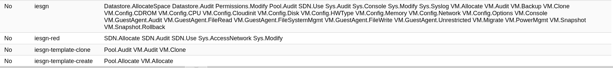
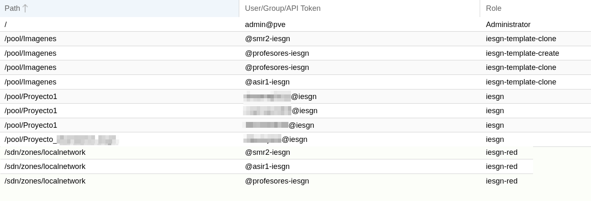

<!-- _class: portada -->
<!-- _paginate: false -->

# Virtualización con **Proxmox VE**

## Sesión 4 · Configuración específica de Proxmox VE en el IES Gonzalo Nazareno

  📧 José Domingo Muñoz
  🏫 IES Gonzalo Nazareno · Dos Hermanas
  🌐 <a href="https://josedom24.github.io/curso_proxmox_2026" style="color:white">josedom24.github.io/curso_proxmox_2026</a>
  💻 <a href="https://github.com/josedom24/curso_proxmox_2026" style="color:white">github.com/josedom24/curso_proxmox_2026</a>

---

<!-- _class: capitulo -->
<!-- _paginate: false -->

01

# Configuración específica en nuestro centro

## Objetivos y principios

---

## Conceptos clave (I)

### Pools de recursos

Agrupación lógica de:
- **Máquinas virtuales (MV)**
- **Contenedores (LXC)**
- **Almacenamiento**

Para facilitar su gestión y asignación de cuotas.

Cada usuario o departamento puede tener su propio pool.

Permite **organizar y limitar** los recursos disponibles.

### Usuarios y Grupos

**Usuarios**: cuentas individuales que acceden a Proxmox (integrados con LDAP del centro).

**Grupos**: agrupaciones de usuarios para facilitar la asignación de permisos comunes.

Simplifica la **administración de permisos a escala**.

---

## Conceptos clave (II)

### Rol

Conjunto predefinido de **permisos** asociados a una función específica.

Ejemplos: *Administrator*, *PVEAdmin*, *PVEUser*, *PVEVMUser*

Cada rol define un **conjunto de capacidades**.

### Permisos

Reglas que definen **qué acciones puede hacer** cada usuario sobre cada recurso.

Se asignan combinando: usuario/grupo + rol + recurso (nodo, VM, pool, etc.)

Control **granular y flexible**.

---

## ¿Qué queríamos conseguir? (I)

### Control de recursos

Usuarios que **controlen sus propios recursos** en Proxmox:
- Máquinas virtuales (MV)
- Contenedores LXC
- Almacenamiento asignado

Cada usuario gestiona su espacio de forma **independiente y segura**.

### Limitaciones de seguridad

Las **redes no pueden ser controladas** por usuarios — es una restricción de seguridad.

Solo el administrador configura la topología de red, bridges y VLANs.

**Garantiza la integridad** de la infraestructura de red.

---

## ¿Qué queríamos conseguir? (II)

### Creación rápida de máquinas

Aunque los usuarios pueden crear MV desde una ISO, queremos que lo hagan de forma **rápida y ágil**.

**Solución**: **clonar plantillas predefinidas** que ya tenemos preparadas.

**Ventajas:**
- Ahorra tiempo de instalación
- Garantiza configuraciones **consistentes**
- Todos los alumnos parten del mismo estado
- Reduce errores de instalación

---

## Roles creados en nuestro Proxmox VE (I)

En el IES hemos definido **cuatro roles** para separar responsabilidades y permitir que cada usuario tenga solo los permisos necesarios:

### `iesgn`

**Rol de usuario estándar**

Usuario completo que puede **crear, modificar y gestionar** sus propias máquinas virtuales con amplia autonomía.

Sin acceso de administrador del clúster.

### `iesgn-red`

**Rol de redes**

Acceso especializado para la **administración de redes SDN**.

Crear y gestionar redes virtuales sin tocar VMs ni almacenamiento.

---

## Roles creados en nuestro Proxmox VE (II)

### `iesgn-template-clone`

**Rol para clonar plantillas**

Usuario que **solo puede crear VMs** clonando plantillas ya existentes.

No puede modificar ni crear plantillas nuevas.

### `iesgn-template-create`

**Rol para crear plantillas**

Usuario autorizado a **crear nuevas máquinas** que se convertirán en plantillas.

Complemento del rol anterior en el flujo de trabajo de plantillas.

---

## Permisos detallados por rol

<table style="width:100%; font-size:0.85rem; margin-top:0.5rem">
<thead>
  <tr style="background:#f0f0f0">
    <th style="width:35%; text-align:left; padding:0.5rem">Rol</th>
    <th style="width:65%; text-align:left; padding:0.5rem">Permisos</th>
  </tr>
</thead>
<tbody>
  <tr>
    <td style="padding:0.4rem; border-bottom:1px solid #ddd"><strong>iesgn</strong></td>
    <td style="padding:0.4rem; border-bottom:1px solid #ddd; font-size:0.8rem"><code>Datastore.AllocateSpace</code> <code>Datastore.Audit</code> <code>Permissions.Modify</code> <code>Pool.Audit</code> <code>SDN.Use</code> <code>Sys.Audit</code> <code>Sys.Console</code> <code>Sys.Modify</code> <code>Sys.Syslog</code> <code>VM.Allocate</code> <code>VM.Audit</code> <code>VM.Console</code> <code>VM.PowerMgmt</code> <code>VM.Backup</code> <code>VM.Clone</code> <code>VM.Migrate</code> <code>VM.Snapshot</code> <code>VM.Snapshot.Rollback</code> <code>VM.Config.*</code> <code>VM.GuestAgent.*</code></td>
  </tr>
  <tr>
    <td style="padding:0.4rem; border-bottom:1px solid #ddd"><strong>iesgn-red</strong></td>
    <td style="padding:0.4rem; border-bottom:1px solid #ddd; font-size:0.8rem"><code>SDN.Allocate</code> <code>SDN.Audit</code> <code>SDN.Use</code> <code>Sys.Modify</code></td>
  </tr>
  <tr>
    <td style="padding:0.4rem; border-bottom:1px solid #ddd"><strong>iesgn-template-clone</strong></td>
    <td style="padding:0.4rem; border-bottom:1px solid #ddd; font-size:0.8rem"><code>Pool.Audit</code> <code>VM.Audit</code> <code>VM.Clone</code></td>
  </tr>
  <tr>
    <td style="padding:0.4rem"><strong>iesgn-template-create</strong></td>
    <td style="padding:0.4rem; font-size:0.8rem"><code>Pool.Allocate</code> <code>VM.Allocate</code></td>
  </tr>
</tbody>
</table>

---

## ¿Cómo podemos conseguirlo? (I)

#### 1. Grupos de usuarios

Los usuarios se agrupan por **curso o categoría**:
- `@asir1-iesgn` — alumnos de 1º ASIR
- `@smr2-iesgn` — alumnos de 2º SMR
- `@profesores-iesgn` — profesores

Facilita la **asignación masiva de permisos**.

---

## ¿Cómo podemos conseguirlo? (II)

#### 2. Pools de recursos

- **Pool "Proyecto de usuario"**
  - Asignado a cada usuario individual o grupo
  - Cada usuario crea sus propios recursos en su pool
  - Proporciona **aislamiento y seguridad**

- **Pool "Imágenes"**
  - Repositorio centralizado de plantillas
  - Los usuarios pueden **clonar plantillas** de aquí
  - Solo profesores pueden crear/modificar plantillas

---

## Asignación de permisos

### Cuatro ámbitos del control de acceso

1. **Administración global** → solo `admin@pve` en la raíz.

2. **Plantillas** → profesores las producen, todos las consumen.

3. **Proyectos de alumnos** → cada alumno (o grupo reducido) gestiona únicamente su propio pool, sin ver ni tocar los de los demás.

4. **Red SDN** → todos los colectivos pueden trabajar con redes virtuales dentro de la zona `localnetwork`, pero sin afectar la red física del clúster.

### Principio de diseño

**Mínimo privilegio**: cada usuario recibe solo los permisos necesarios para su función, con **herencia automática** hacia los recursos dentro de su ámbito.

---

## Tabla de ACLs — Ejemplo práctico

---

## Posibles mejoras

### 1. Rol `iesgn-profesor`

Crear un rol específico para profesores que incluya `Pool.Allocate`, permitiendo:
- Crear plantillas en su proyecto personal (sin exposición al alumnado)
- Reasignarlas a `/pool/Imagenes` cuando estén listas
- Actualmente el profesor puede hacer plantillas directamente en el `/pool/Imagenes`

### 2. Acceso supervisado a pools del alumnado

Otorgar al grupo `profesores-iesgn` acceso de auditoría o intervención sobre los pools del alumnado:
- Supervisar y evaluar el trabajo en curso
- Diagnosticar incidencias técnicas
- Intervenir en situaciones bloqueantes sin credenciales admin

---

<!-- _class: capitulo -->
<!-- _paginate: false -->

02

# DEMO 1: Clonación de MV de un usuario

## Perfil alumno

---

<!-- _class: capitulo -->
<!-- _paginate: false -->

02

# DEMO 2: Configuración de máquinas virtuales usando cloud-init

## Automatización de la configuración inicial

---

<!-- _class: capitulo -->
<!-- _paginate: false -->

03

# Scripts de administración

## Instrucciones de línea de comandos para automatización

---

<!-- _class: capitulo -->
<!-- _paginate: false -->

04

# Ampliación y escalabilidad del sistema

## Evolución de la infraestructura

---

## Ampliación y escalabilidad del sistema

### Almacenamiento remoto SAN/NAS

- Centralización del almacenamiento
- Mayor capacidad y flexibilidad
- Independencia del servidor físico

### Clúster de alta disponibilidad

- Múltiples nodos Proxmox
- Migración en vivo de máquinas
- Redundancia y tolerancia a fallos
- Escalabilidad horizontal

---

<!-- _class: cierre -->
<!-- _paginate: false -->

# ¡Gracias!

  📧 José Domingo Muñoz
  🏫 IES Gonzalo Nazareno · Dos Hermanas
  🌐 https://josedom24.github.io/curso_proxmox_2026

